# CrabsMLearning
## Description
This project is developed as a useful machine learning research tool. Currently, is
in alpha development stage, which means, some methods may be unstable or change between
the updates.

## Installation
The project includes a file named **setup.txt**. The file contains the
appropriate commands needed to be installed.

### Dependencies
The program has been developed and tested using the following packages:

- pyside2==5.15.2
- PyQt5==5.15.4
- QDarkStyle==3.0.2
- pandas==1.2.3
- matplotlib==3.4.1
- sklearn==0.24.1
- openpyxl==3.0.7
- tensorflow==2.4.1
- seaborn==0.11.1
- dtw-python==1.1.10
- keras-tuner==1.1.0

# Documentation

## Machine Learning Regression

### Step 0: Open the Application Window
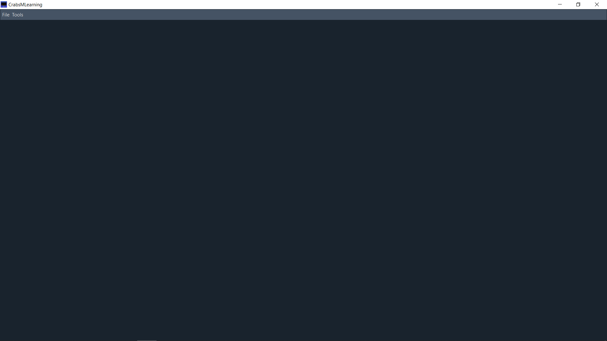

### Step 1: Open the Machine Learning Regression Window
Follow the path to open the Machine Learning Regression Window

**Tools &#8594; Machine Learning &#8594; Machine Learning Regression**

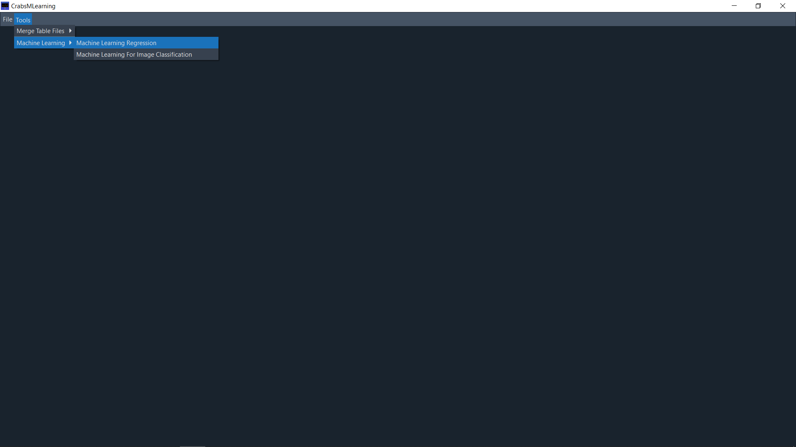

### Step 2: Machine Learning Window
In the Machine Learning Regression Window on the left down corner there is the green cross button. 
Press it to open the add file window.

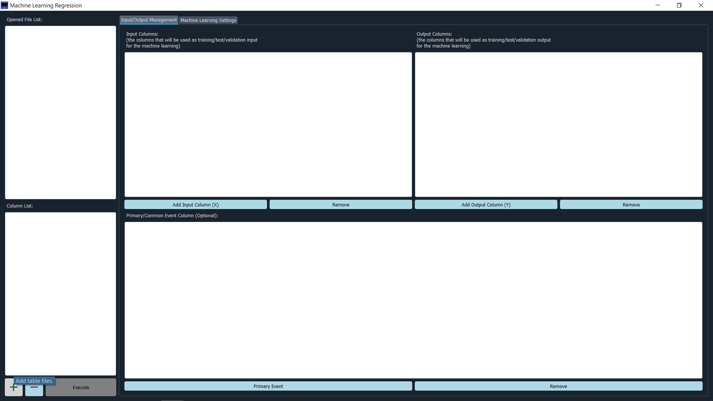

### Step 3: Add File
The application, currently, supports CSV and XLSX data table formats. Follow the path and select
the correct file format and then press open or double click to file for opening the file.

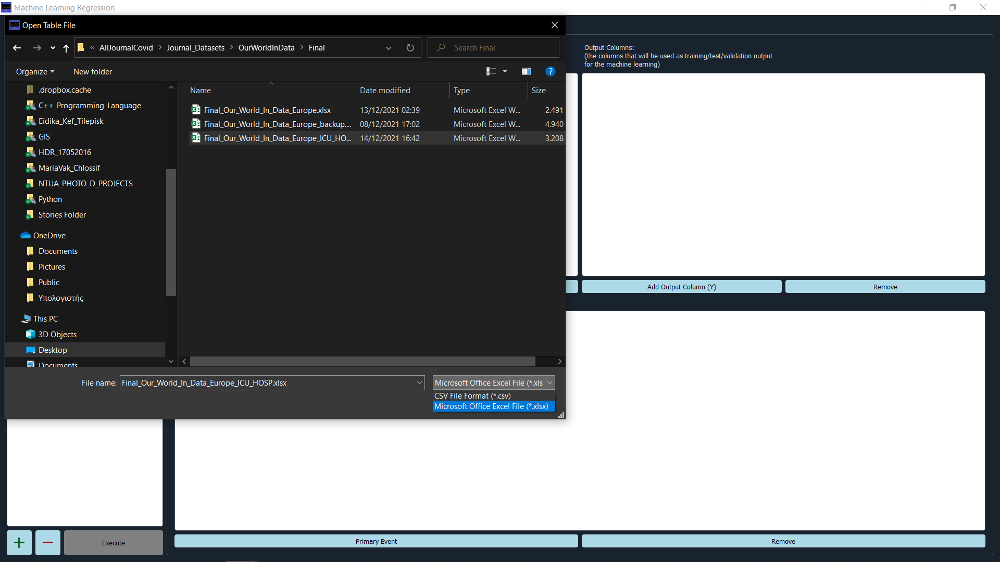

### Step 4: Opened File
After a while, the name of the file will appear in the Opened File List and the
columns contained in the Column List.

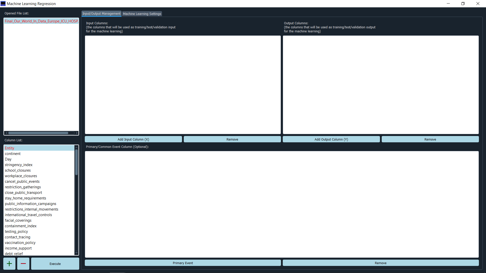

### Step 5: Select Machine Learning Input/Output Columns
There are multiple combinations to create a dataset for a machine learning. The application
currently supports:
- Select the columns, which will be used in the creation of **Input Array (X)** and 
  **Output Array (Y)**.
- If the dataset includes some categorized features (e.g. Countries) a column needs th be 
  added in **Primary/Common Event Column (Optional)** cell. This column will be used to create
  an Input Array (X) and an Output Array (Y), for each category and calculate statistical information
  later for each event (e.g. the accuracy of the global model for each country).

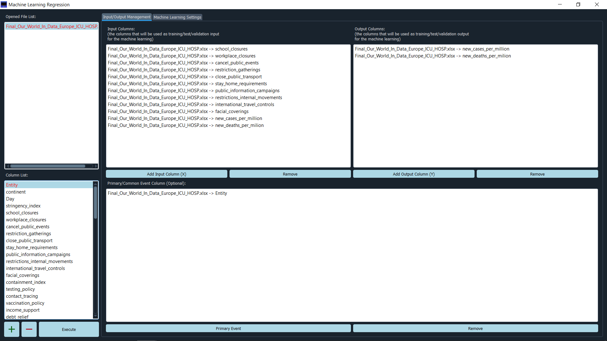

After selecting the columns for each list, the next step is to edit the Machine Learning Setting.

### Step 6: Machine Learning Setting &#8594; General

The General tab, contains the basic information of the Machine Learning process, such us the percentage of
test and validation sets, the path for the output folder (which stores the created model(s) and other statistical
information), different methods for creating the X and Y arrays (sequential for time-series analysis, average for
statistical analysis, sequential-average for time-series statistical analysis), method usage index (indicated 
how many rows will be used to create an input/output row for training-validation, test sets, e.g. for time-series
analysis if method index=7 then a weekly range will be applied), filter usage index (an index used for data convolve)
and multifile training processing (a parameter used for running multiple machine learning processes at the same
time, currently only the Linear Training-Testing is supported).

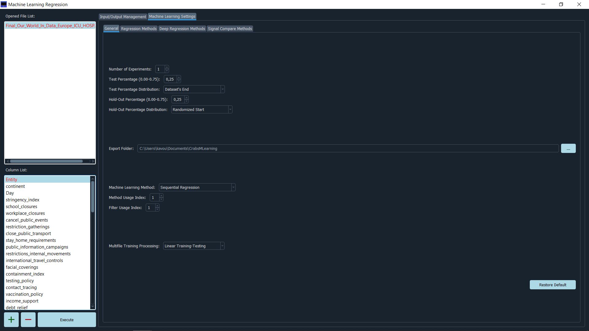

### Step 7: Machine Learning Setting &#8594; Regression Methods

The Regression Method tab, contains all the available common regressors. Most of the methods are currently under
development.

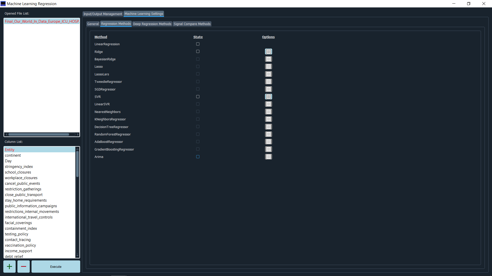

### Step 8: Machine Learning Setting &#8594; Deep Regression Methods

This tab contains the deep machine learning supported by the application. Different deep machine learning models
can solve, different problems, thus this tab will be enriched and updated accordingly, with models, which solve
different problems.

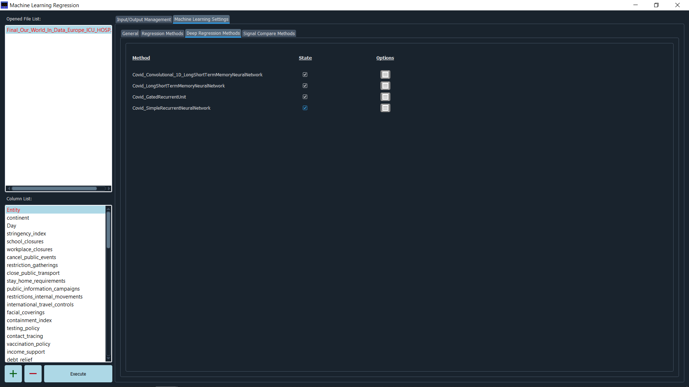

### Step 9: Machine Learning Setting &#8594; Signal Compare Methods

Signal compare methods tab, contains some statistical methods, which used afterwards. These methods, run after the
training of the model(s) and compare the forecasted values, with the real values. Each method produces significant
statistical metrics, which may help the researcher to improve the accuracy of the models in next executions. Also,
these metrics may help the researcher to find additional correlation(s) of the dataset.

These metrics, are optional. The application calculated by default the most common statistical errors:
mean absolute error (MAE), root mean squared error (RMSE) and max error and export them in a table format.

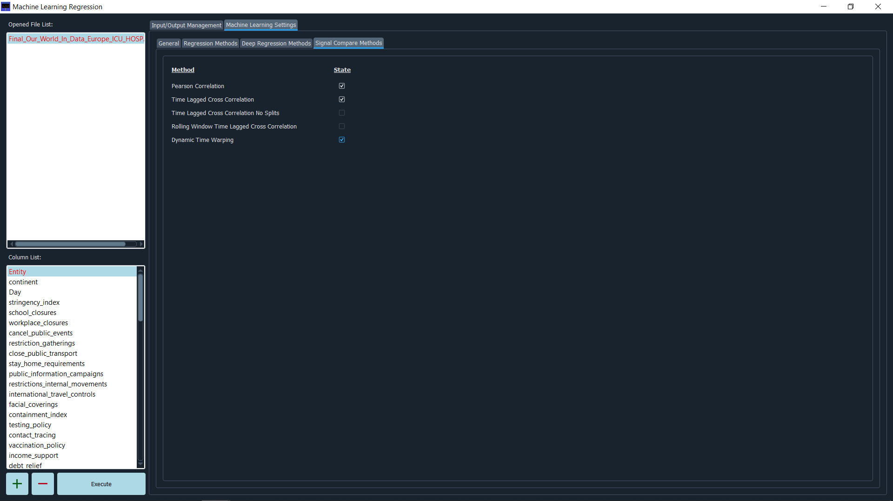

### Step 10: Execute
Finally, by pressing the Execute button the application perform the machine learning process. 

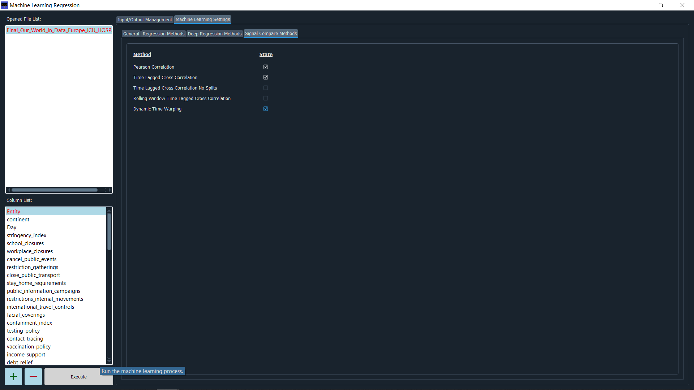

# Project State
Alpha Version: Still Under Development. Feel free to mail me for ideas or work with me to set up the best interface for Statistical, Deep/Machine Learning and Big Data Analysis.
